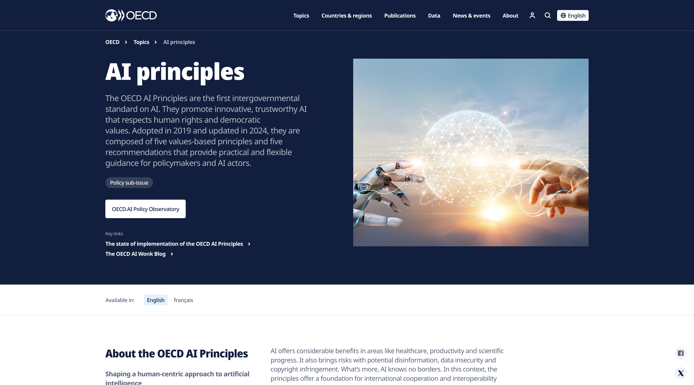

# OECD — AI Principles

## Standard Profile
- **Domain:** Governance
- **Pack ID:** `gov-05-oecd-ai-principles`
- **Version:** `1.0`
- **Jurisdiction:** International (OECD)
- **Type:** Principles

## Official Standard Link
- [OECD — AI Principles](https://www.oecd.org/en/topics/sub-issues/ai-principles.html)

## Brief Info
Reference checklist pack for OECD — AI Principles. Jurisdiction: International (OECD). Type: Principles.

## Website Screenshot

## How This Is Used In TrustStack
This standard is represented as a versioned pack and contributes checklist controls, expected evidence, and audit-ready mapping context.
